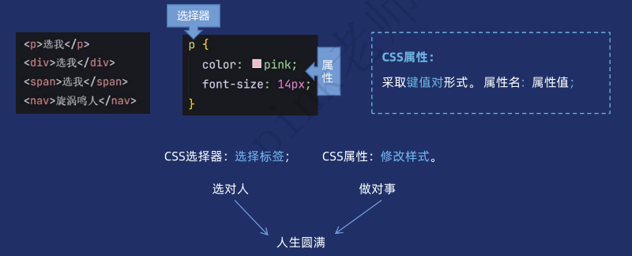
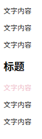
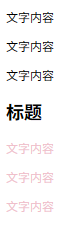

# CSS核心技术

## CSS介绍

CSS (Cascading Style Sheets，层叠样式表)。是用来控制网页在浏览器中的显示外观的语言。

CSS3 现在已被大部分现代浏览器支持，而下一版的 CSS4 仍在开发中。

## CSS分类

### 内联样式表（行内样式表）

样式写到标签内部，可以控制当前标签的样式，特殊情况使用。

~~~html
<p style="color: red; font-size: 14px;">文字内容</p>
~~~

### 内部样式表

写到<head>标签中，脱离结构，可以控制当前页面的所有标签，较为常用。

### 外部样式表

单独新建一个CSS文件，完全脱离结构，可以控制整个网站的所有标签，最常用。

~~~html
<link rel="stylesheet" href="./css/index.css">
~~~

## CSS选择器

CSS选择器是CSS规则的第一部分。它是选择HTML元素的方式。

选择器分类：

根据使用场景不同，选择器也分不同类型。

### 基础选择器

基础选择器指的是有单个选择器组成，常见的有：类型选择器（标签选择器）、类选择器、id选择器以及通配符选择器。

#### 类型选择器（标签选择器）

类型选择器选择某个类型的元素，也称为标签选择器。

>CSS 层叠性：
>
>CSS 规则可以同时作用于一个元素，浏览器通过特定规则决定最终生效的样式。层叠性解决了样式冲突问题。
>
>原则：后定义的样式覆盖先前的样式。（就近原则）

~~~CSS
/* 选择所有div标签修改样式 */
div {
  color: gold;
}

/* 选择所有span标签修改样式 */
span {
  color: green;
}
~~~

#### 类选择器

类选择器选择某1个元素或者多个元素。

语法：

.类名 { 样式声明；… }

~~~CSS
<style>
  .pink {
    color: pink;
  }

.sub-nav {
  font-size: 20px;
}
</style>
~~~

<标签 class=“类名”>

~~~html
<ul>
  <li class="pink">111</li>
  <li>222</li>
  <li class="pink sub-nav">333</li>
  <li>444</li>
  <li>555</li>
</ul>
~~~

>类选择器的权重（优先级）高于类型选择器

>注意：
>
>1.类名自定义，不能是中文、纯数字
>
>2.多个英文单词组成尽量使用-链接
>
>3.命名有要意义，尽量见名知义
>
>4.class属性可以有多类名中间用空格隔开

#### id选择器

选择HTML中具有特定id属性的**唯一**元素

```css
#header {
  color: blue;
}
```

```html
<div id="header">修改样式</div>
```

> 类选择器
>
> 语法：以.开头，后跟类名(如.nav)
>
> 作用：选择class属性的一个或多个元素
>
> 特点：可以使用多次
>
> 类似：身份证的名字，可以使用多次
>
> 场景：后期修改样式基本都是类选择器

> id选择器
>
> 语法：以#开头，后跟id名（如#header）
>
> 作用：选择特定id属性的唯一元素
>
> 特点：同一页面中，id值必须唯一（不能重复）
>
> 类似：身份证的编号，唯一，只能用一次
>
> 场景：后期主要是配合JavaScript添加交互效果

#### 通配符选择器

通配符选择器可以选择HTML中**所有**的标签，进行样式修改。

```css
* {
  margin: 0;
  padding: 0;
}
```

特殊情况下通过通配符清除所有元素的默认边距和填充，统一不同浏览器的默认样式。

```css
* {
  margin: 0; /* 去除所有元素的外边距 */
  padding: 0; /* 去除所有元素的内边距 */
  box-sizing: border-box; /* 统一盒模型 */
}
```

#### 基础选择器总结

| 选择器类型   | 语法示例          | 匹配范围                    | 复用性       | 典型使用场景                             | 注意事项                       |
| ------------ | ----------------- | --------------------------- | ------------ | ---------------------------------------- | ------------------------------ |
| 类型选择器   | `div { ... }`     | 匹配所有指定 HTML 标签元素  | 某一类型标签 | 全局样式重置、基础标签样式（如 body, p） | 避免滥用，可能导致样式冲突     |
| 类选择器     | `.nav { ... }`    | 匹配所有含指定 class 的元素 | 多次使用     | 多元素共享样式                           | 优先使用，避免与 ID 选择器冲突 |
| ID 选择器    | `#header { ... }` | 匹配唯一含指定 id 的元素    | 唯一性       | 唯一元素标识                             | 必须唯一，避免样式覆盖风险     |
| 通配符选择器 | `* { ... }`       | 匹配所有元素                | 全局覆盖     | 全局样式重置                             | 性能较差，慎用                 |

#### 画盒子案例-网页基本布局

##### 设置盒子宽高背景色

~~~CSS
.header {
  /* 通栏，宽不写默认和浏览器宽度一致 */
  height: 80px;
  background-color: black;
}

.nav {
  width: 1500px;
  height: 60px;
  background-color: skyblue;
}
~~~

##### 让块级盒子在浏览器中水平居中对齐

~~~CSS
/* 让块级盒子在浏览器中水平居中对齐 */
.conter {
  margin: 0 auto;
}
~~~

##### 清除默认外边距和内边距

~~~CSS
* {
  /* 清除默认外边距和内边距 */
  margin: 0;
  padding: 0;
}
~~~

### 关系选择器

关系选择器是通过位置关系来选择目标元素(标签)，可以更精准选择某些元素。常见的有：后代选择器，子代选择器，邻接兄弟选择器，通用兄弟选择器。

#### 后代选择器

选择某个元素的后代元素（不限层级，包括子元素、孙元素等）

~~~CSS
div p {
  color: pink;
}
~~~

~~~html
<div>
  <p>我是文字</p>
</div>
<p>我是文字</p>
~~~

>说明：
>
>选择div标签里面的p元素，中间空格隔开。
>
>父级div作用是限定，子元素p修改样式。
>
>父级和子集都可以是任意选择器。

#### 子代选择器

选择某个元素的直接子元素（仅限一层）

~~~CSS
div>span {
  color: pink;
}
~~~

~~~html
<div>
  <span>我是儿子</span>
  <p>
    <span>我是孙子</span>
  </p>
</div>
~~~

选择div标签里面的第一层span元素，中间>隔开，理解为亲儿子

特殊场景使用

#### 兄弟选择器

~~~html
<div class="box">
  <p>文字内容</p>
  <p>文字内容</p>
  <p>文字内容</p>
  <h2>标题</h2>
  <p>文字内容</p>
  <p>文字内容</p>
  <p>文字内容</p>
</div>
~~~

##### 邻接兄弟选择器

~~~CSS
h2+p {
  color: pink;
}
~~~

选中紧跟在h2后面的第一个p元素



##### 通用兄弟选择器

~~~CSS
h2~p {
  color: pink;
}
~~~

选中紧跟在h2后面的所有p元素



#### 关系选择器总结

| 选择器         | 语法    | 选择范围             | 实例                            |
| -------------- | ------- | -------------------- | ------------------------------- |
| 后代选择器     | `A B`   | 所有后代（跨层级）   | `ul li {color: pink;}`          |
| 子代选择器     | `A > B` | 直接子元素（仅一层） | `div>span {color: pink;}`       |
| 邻接兄弟选择器 | `A + B` | 紧邻的下一个同级元素 | `h2+p {}` 标题后的第一个 p 元素 |
| 通用兄弟选择器 | `A ~ B` | A 之后的所有同级元素 | `h2~p {}` 标题后的所有 p 元素   |

## 其他

### CSS书写规范

良好的书写规范，让我们更专业。虽然代码自动格式化但是我们还需要了解。

1.选择器和大括号中间保留1个空格距离。

2.属性名和属性值中间也要保留1个空格。

3.每个CSS属性单独占一行。后期会打包压缩无需担心体积问题。

```css
p {
  color: gold;
  font-size: 20px;
}
```

### CSS注释+AI注释

CSS注释的快捷键是 ctrl+/,注意注释内容左右两侧保持一个空格距离是良好习惯。

```css
span {
  /* 这里添加注释 */
  color: green;
}
```

AI工具（Trae）注释：

1.单个属性注释可以在CSS属性后面打一个空格即可自动添加注释。

2.如果想要给多个属性添加注释，选中CSS添加到右侧对话区，输入提示词即可。


CSS选择器是CSS规则的第一部分。它是选择HTML元素的方式。