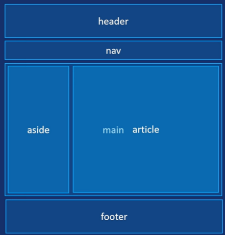

# HTML5

## HTML 基础概念

- **HTML**：超文本标记语言（HyperText Markup Language），用于构建网页结构
- **元素**：由开始标签、内容、结束标签组成
- **属性**：提供元素的额外信息，写在开始标签中

## 基础结构

~~~html
<!DOCTYPE html>
<html lang="en">
<head>
  <meta charset="UTF-8">
  <meta name="viewport" content="width=device-width, initial-scale=1.0">
  <title>页面标题</title>
</head>
<body>
  页面内容
</body>
</html>
~~~

### 页面语义化布局

| 标签        | 含义     | 用途                                       |
| ----------- | -------- | ------------------------------------------ |
| `<header>`  | 页眉     | 页面或区块的头部，通常包含logo、导航、标题 |
| `<nav>`     | 导航     | 主要导航链接区域                           |
| `<main>`    | 主要内容 | 页面的核心内容（每个页面只能有一个）       |
| `<article>` | 文章     | 独立的、可复用的内容区块                   |
| `<section>` | 区块     | 文档中的节或区域                           |
| `<aside>`   | 侧边栏   | 与主要内容相关的辅助信息                   |
| `<footer>`  | 页脚     | 页面或区块的底部，通常包含版权、联系方式   |

 

> 注意：这些标签受兼容性影响，开发时PC端需根据公司要求决定是否使用（用无语义标签div替代），移动端放心使用

### 无语义标签

无语义标签本身没有具体含义，主要用于布局和样式化。

#### div 标签

块级无语义容器，用于分组和布局

```
<div>
  <h2>文章标题</h2>
  <p>这是一段文字...</p>
</div>

<div class="header">页眉区域</div>
<div class="sidebar">侧边栏</div>
<div class="content">主要内容</div>
<div class="footer">页脚区域</div>
```

**特点：**

- 块级元素，独占一行
- 最通用的容器标签
- 配合CSS实现各种布局

#### span 标签

行内无语义容器，用于包裹小段文本

```
<p>
  这是一段文字，其中
  <span style="color: red;">这句话是红色的</span>，
  而<span class="highlight">这句话被高亮</span>。
</p>

<p>价格：<span class="price">¥99.99</span></p>
```

**特点：**

- 行内元素，不换行
- 用于文本局部样式化
- 比div更轻量

## 常用标签

### 标题标签

**显示特点**：标题文字会加粗显示，并且每行只显示一个
**h1唯一性**：最好只对每个页面使用一次h1
**层次性**：一般情况下每页标签层次使用不超过三个

```
<h1>一级标题</h1>  <!-- 最重要的标题 -->
<h2>二级标题</h2>
<h3>三级标题</h3>
<h4>四级标题</h4>
<h5>五级标题</h5>
<h6>六级标题</h6>  <!-- 最次要的标题 -->
```

### 文本格式化

```
<p>段落标签</p>
<br>              <!-- 换行 -->
<hr>              <!-- 水平分割线 -->
<strong>粗体文本</strong>
<em>斜体文本</em>
<mark>高亮文本</mark>
<small>小号文本</small>
<del>删除文本</del>
<ins>插入文本</ins>
```

有语义，推荐使用

| 标签                | 作用   |
| ------------------- | ------ |
| `<strong></strong>` | 加粗   |
| `<em></em>`         | 倾斜   |
| `<ins></ins>`       | 下划线 |
| `<del></del>`       | 删除线 |

无语义，不推荐使用

| 标签      | 作用   |
| --------- | ------ |
| `<b></b>` | 加粗   |
| `<i></i>` | 倾斜   |
| `<u></u>` | 下划线 |
| `<s></s>` | 删除线 |

### 图像标签

#### 图像标签的基本使用

```

```

- `src`：图片路径（必需）
- `alt`：图片加载失败时显示的替代文本（建议添加）

#### 图片宽度和高度设置

```
<!-- 建议只用CSS设置宽高 -->


<!-- 同时设置宽高可能导致图片变形 -->

```

**重要提示** 💡

- 一般情况下，宽度和高度**只需设置一个**，另一个会自动等比例缩放
- 同时设置两个值可能**导致图片变形**
- 推荐使用CSS来设置图片尺寸

#### 图像添加标题

```

```

- `title`：鼠标悬停时显示的提示文本

#### 常见图片格式对比

| 格式             | 特点                    | 适用场景                       | 优缺点                                                      |
| ---------------- | ----------------------- | ------------------------------ | ----------------------------------------------------------- |
| **JPEG (.jpg)**  | 有损压缩，色彩丰富      | 照片、风景图、人物照           | ✅ 文件小，加载快❌ 压缩会丢失细节，多次编辑质量下降          |
| **PNG (.png)**   | 无损压缩，支持透明      | 图标、标志、需要透明背景的图片 | ✅ 质量无损，支持alpha通道透明❌ 文件体积较大                 |
| **GIF (.gif)**   | 支持动画，最多256色     | 简单动画、表情符号             | ✅ 支持动画，文件小❌ 色彩有限，不适合复杂图像                |
| **WebP (.webp)** | 现代格式，有损/无损可选 | 网页图片优化                   | ✅ 文件小，加载快❌ 部分旧浏览器不支持                        |
| **AVIF (.avif)** | 最新格式，压缩率高      | 摄影作品、高分辨率图像         | ✅ 压缩率极高，画质优秀，支持HDR/透明/动画❌ 兼容性仍在发展中 |
| **SVG (.svg)**   | 矢量图形，可缩放        | 图标、简单图形                 | ✅ 文件小，无限缩放不失真❌ 不支持复杂图像和动画              |

#### 选择建议

- **照片/复杂图像**：优先使用 JPEG 或 WebP
- **需要透明背景**：使用 PNG
- **简单动画**：使用 GIF
- **图标/标志**：使用 SVG
- **追求最佳性能**：WebP 或 AVIF（需考虑浏览器兼容性）

### 视频标签

```
<!-- 基础用法：属性和值相同时可以省略值 -->
<video src="media/莱卡恩动态壁纸_yyyyooo制作.MP4" width="500" controls></video>
```

#### 视频标签的常用属性

- **controls**：显示播放控件
- **autoplay**：自动播放（需配合muted使用）
- **loop**：循环播放
- **muted**：静音播放
- **poster**：视频封面图

> 注意：想要自动播放，需要先设置静音播放，否则会被浏览器拦截

#### 示例：使用多个属性

```
<video 
  src="media/莱卡恩动态壁纸_yyyyooo制作.MP4" 
  width="500" 
  controls
  autoplay
  loop
  muted
  poster="media/莱卡恩动态壁纸_yyyyooo制作.jpg">
</video>
```

#### 视频标签的兼容性写法

```
<video controls width="500">
  <source src="media/莱卡恩动态壁纸_yyyyooo制作.MP4" type="video/mp4">
  <!-- 可以添加多种格式的视频源 -->
  <!-- <source src="media/视频.webm" type="video/webm"> -->
  <!-- <source src="media/视频.ogg" type="video/ogg"> -->
  <p>您的浏览器不支持视频标签，请升级浏览器</p>
</video>
```

### 音频标签

```
<audio src="media/StayRightHere-VISTY.MP3" controls></audio>
```

#### 音频标签的常用属性

- **controls**：显示播放控件
- **autoplay**：自动播放（浏览器通常禁止，需用JS实现）
- **loop**：循环播放
- **muted**：静音播放

> 注意：音频标签的自动播放通常被浏览器限制，后续可以用JavaScript来实现

#### 音频标签的兼容性写法

```
<audio controls>
  <source src="media/StayRightHere-VISTY.MP3" type="audio/mp3">
  <!-- <source src="media/音乐.ogg" type="audio/ogg"> -->
  <p>您的浏览器不支持音频标签，请升级浏览器</p>
</audio>
```

#### 学习要点

1. **属性简写**：当属性名和属性值相同时（如`controls="controls"`），可以简写为`controls`

2. 自动播放策略

   ：现代浏览器出于用户体验考虑，通常会限制自动播放

   - 视频：可以设置`muted`后实现自动播放
   - 音频：需要用户交互后才能播放

3. **兼容性处理**：使用`<source>`标签提供多种格式，并添加友好的提示信息

### 超链接以及锚点链接

#### 超链接基础语法

```
<a href="目标地址">链接文本</a>
```

#### 链接类型

##### 内部链接

链接到本站点内的其他页面

```
<a href="05-视频和音频标签.html">音视频</a>
```

##### 外部链接

链接到其他网站的页面

```
<a href="https://www.baidu.com" title="百度" target="_blank">百度一下</a>
```

##### 空链接

用于占位或触发JavaScript事件

```
<a href="#">空链接</a>
```

##### 下载链接

链接到可下载的文件资源

```
<a href="media/StayRightHere-VISTY.MP3" download="StayRightHere-VISTY.MP3">下载音频</a>
```

##### 邮件链接

点击后打开默认邮件客户端

```
<a href="mailto:123@qq.com">发送邮件</a>
```

#### 锚点链接

页面内跳转，实现"返回顶部"等功能

**步骤1：设置目标锚点**

```
<h2 id="top">这是一个标题</h2>
```

**步骤2：创建跳转链接**

```
<a href="#top">返回顶部</a>
```

#### 链接重要属性

| 属性       | 说明             | 示例值                                  |
| ---------- | ---------------- | --------------------------------------- |
| `href`     | 链接地址（必需） | `https://www.baidu.com`                 |
| `target`   | 打开方式         | `_blank`（新窗口）、`_self`（当前窗口） |
| `title`    | 悬停提示文本     | `百度`                                  |
| `download` | 下载文件         | `文件名.后缀`                           |

#### 平滑滚动效果

在`<style>`标签中添加CSS，实现平滑的锚点跳转：

```
<style>
  html {
    scroll-behavior: smooth;
  }
</style>
```

#### 学习要点

1. **target="_blank"**：在新标签页打开链接，不离开当前页面
2. **title属性**：提升用户体验，鼠标悬停时显示提示
3. **锚点链接**：必须用`id`属性标记目标位置
4. **空链接**：`#`作为占位符，常用于开发中
5. **下载链接**：需指向可下载文件，部分浏览器有限制

### 列表

```
<!-- 无序列表 -->
<ul>
  <li>项目1</li>
  <li>项目2</li>
</ul>
<!-- 
  ul里只能放li
  li可以放其他元素 
-->

<!-- 有序列表（使用非常少） -->
<ol>
  <li>第一步</li>
  <li>第二步</li>
</ol>

<!-- 描述列表（常用于页面底部） -->
<dl>
  <dt>术语</dt>
  <dd>定义描述</dd>
</dl>
```

### 表格

```
<table border="1">
<!--表格头部区域-->
  <thead>
    <tr>
      <th>表头1</th>
      <th>表头2</th>
    </tr>
  </thead>
  <!--表格主题内容-->
  <tbody>
    <tr>
      <td>行1列1</td>
      <td>行1列2</td>
    </tr>
    <tr>
      <td>行2列1</td>
      <td>行2列2</td>
    </tr>
  </tbody>
  <!--表格底部区域-->
  <!-- <tfoot></tfoot> -->
</table>
```

#### 合并单元格

表格开发中很少使用合并，因为会导致表格难以维护，且可能影响响应式适配（尤其在移动端）。如果特殊情况，可以借助于AI。
**原理：**

1. 确定是跨行（rowspan）还是跨列合并（colspan）
2. 找到目标单元格（左上原则），写合并数量
3. 删掉多余单元格

### 表单

收集用户输入数据，并将数据提交到后端进行处理

#### 表单容器

form标签，定义表单的容器包裹所有控件。
action属性定义了在提交表单时，应该把所收集的数据送给谁（URL）去处理

```
<form action=""></form>
```

#### 表单控件

##### input 表单

通用输入控件

```
<input type="text">
```

| type属性值 | 说明       |
| ---------- | ---------- |
| text       | 单行文本框 |
| password   | 密码框     |
| radio      | 单选框     |
| checkbox   | 复选框     |
| file       | 文件框     |

###### 文本框和密码框

| 其他属性     | 说明                                                         |
| ------------ | ------------------------------------------------------------ |
| placeholder  | 提示信息                                                     |
| name         | 元素的名称                                                   |
| maxlength    | 允许的最大字符数                                             |
| accesskey    | 使元素获得焦点的快捷键                                       |
| autocomplete | 用于控制比表单的自动填充行为，帮助浏览器决定是否根据用户历史输入自动填充字段值，取值on/off |

```
<form action="">
  <ul>
    <li>
      账号：<input type="text" , name="username" , placeholder="请输入账号" , autocomplete="off" , accesskey="u">
    </li>
    <li>
      密码：<input type="password" name="password" placeholder="请输入密码" , maxlength="6">
    </li>
  </ul>
</form>
```

###### 单选框和复选框

| 其他属性 | 说明             |
| -------- | ---------------- |
| name     | 表单名称实现分组 |
| value    | 表单值           |
| checked  | 是否默认选中     |

```
<li>
  性别：
  <input type="radio" name="gender" value="0" , checked> 女
  <input type="radio" name="gender" value="1"> 男
</li>
<li>
  爱好：
  <input type="checkbox" name="hobby" value="0"> 足球
  <input type="checkbox" name="hobby" value="1"> 篮球
  <input type="checkbox" name="hobby" value="2"> 跑步
</li>
```

###### 文件域 file

用于用户上传文件

| 其他属性 | 说明                                       |
| -------- | ------------------------------------------ |
| multiple | 允许选择多个文件                           |
| accept   | 规定选择的文件类型，多个类型中间用逗号分割 |

```
<input type="file" name="file" multiple accept=".jpg,.png,.gif">
```

##### textarea 表单

多行文本输入框，也称文本域，适用于允许用户输入大量自由格式文本的场景，例如评论或反馈表单。

| 常见属性    | 说明                       |
| ----------- | -------------------------- |
| name        | 表单名称                   |
| placeholder | 提示信息                   |
| rows        | 文本行数，正整数，默认为2  |
| cols        | 文本列数，正整数，默认为20 |

```
<textarea name="message" id="" cols="30" rows="10" placeholder="请输入留言："></textarea>
```

##### select 表单

下拉表单控件，提供一个选项菜单的控件。
因为select很难修改为好看的效果，大部分下拉列表可以通过其他标签模拟实现。

```
城市：
<select name="city" id="">
  <option value="北京">北京</option>
  <option value="上海">上海</option>
  <option value="广州" selected>广州</option>
  <option value="深圳">深圳</option>
</select>
```

##### button 按钮

disabled属性可以禁用按钮，无法点击

```
<button>登录</button>
```

#### 辅助标签label

表示用户界面中某个元素的说明。提升可访问性（点击标签可聚焦输入框）
**方式一**：
利用for和id相关联

```
性别：
<input type="radio" name="gender" value="0" , checked id="nv">
<label for="nv">女</label>
<input type="radio" name="gender" value="1" id="nan">
<label for="nan">男</label>
```

**方式二**：
直接包含

```
爱好：
<label>
  <input type="checkbox" name="hobby" value="0"> 足球
</label>
<label>
  <input type="checkbox" name="hobby" value="1"> 篮球
</label>
<label>
  <input type="checkbox" name="hobby" value="2"> 跑步
</label>
```

1. 块级 vs 内联元素

### 块级元素

- 独占一行，宽度占满父容器
- 常见块级元素：`<div>`, `<p>`, `<h1>~<h6>`, `<ul>`, `<li>`, `<table>`

### 内联元素

- 不会换行，只占自身内容宽度
- 常见内联元素：`<span>`, `<a>`, ``, `<strong>`, `<em>`

##  路径分类

### 绝对路径

完整的网络地址或本地磁盘路径

```
<!-- 网络绝对路径 -->

<a href="https://www.baidu.com">百度</a>

<!-- 本地绝对路径（不推荐） -->

```

**特点：**

- ✅ 指向明确，不受当前文件位置影响
- ❌ 依赖网络连接（网络路径）
- ❌ 移植性差，更换域名或目录后链接失效
- ❌ 本地路径在不同电脑上可能无效

### 相对路径

相对于当前文件所在位置

#### 同一级目录

文件和引用文件在同一文件夹中

```
<!-- 直接写文件名 -->


<a href="about.html">关于我们</a>
```

#### 子级目录

文件在当前文件夹的子文件夹中

```
<!-- 格式：文件夹名/文件名 -->


<a href="html/about.html">关于我们</a>
```

#### 父级目录

文件在当前文件夹的上一级

```
<!-- 格式：../ 表示上一级目录 -->

  <!-- 上两级目录 -->
<a href="../about.html">关于我们</a>
```

### 相对路径符号说明

| 符号     | 含义               | 示例                         |
| -------- | ------------------ | ---------------------------- |
| `./`     | 当前目录（可省略） | `./cat.jpg` 等价于 `cat.jpg` |
| `../`    | 上一级目录         | `../images/cat.jpg`          |
| `../../` | 上两级目录         | `../../photo.jpg`            |

## 常用属性

- `id`：唯一标识符
- `class`：类名（用于CSS样式）
- `style`：内联样式
- `title`：悬停提示文本
- `lang`：语言设置

## 字符实体（特殊字符）

字符实体是一段以连字号（&）开头、以分号（；）结尾的文本（字符串）。
常用于显示保留字符和不可见的字符（如“不换行空格”）

| 显示结果 | 字符实体 |
| -------- | -------- |
| `<`      | `&lt;`   |
| `>`      | `&gt;`   |
| `&`      | `&amp;`  |
| `"`      | `&quot;` |
| 空格     | `&nbsp;` |

